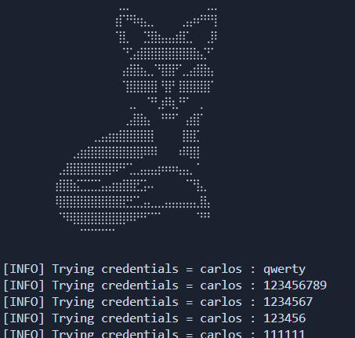
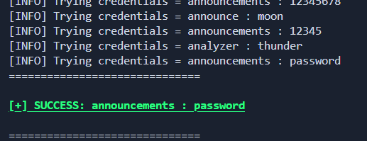

# Lab: Enumeración de usuarios por respuestas diferentes

_Read this in English: [Readme.md](./Readme.md)_

[__Enlace al laboratorio__](https://portswigger.net/web-security/authentication/password-based/lab-username-enumeration-via-different-responses)

> [!NOTE]
> **Análisis del Laboratorio:** Si buscas comprender la vulnerabilidad a fondo, justo debajo de la sección de uso encontrarás una **explicación técnica detallada (sin spoilers)** sobre el funcionamiento del ataque y la lógica de la base de datos.
>Ir directamente [allí](#metodología-y-ética)

# Script de Automatización

Este directorio contiene un exploit desarrollado en Python diseñado para automatizar la detección y explotación de la vulnerabilidad de este laboratorio.

### __Uso__

>Crear entonro virtual con Python (Recomendado)
```
python -m venv venv
```

>Activar el entorno virtual
>- Linux
>```bash
>source venv/bin/activate
>```
>- Windows
>```
>venv\Scripts\activate --> Símbolo del sistema (CMD)
>venv\Scripts\activate.ps1 --> PowerShell
>```


>Instalar dependencias
```
pip install -r requirements.txt
```

>Ejecutar el script
```python
python exploit.py -h --> Muestra la ayuda

python exploit -t [URL] -u [Lista_Ususarios] -p [Lista_Contraseñas]
```
<p align="center">
    
    
</p>

---

## Metodología y Ética

>[!important]
>__Aviso de Aprendizaje:__ A continuación se detalla el funcionamiento de la vulnerabilidad bajo un enfoque pedagógico libre de spoilers. Te animo a enfrentarte al laboratorio por tus propios medios antes de consultar este análisis. La verdadera maestría nace de la resolución persistente de problemas.

---

## Objetivo del Laboratorio

El objetivo es realizar un ataque de __Fuerza Bruta__ con la finalidad de comparar los códigos de estado de las respuestas del servidor para verificar si una combinación de credenciales es correcta.

Para resolverlo, el exploit debe:

1. __Validación de Recursos:__ Verifica la existencia y accesibilidad de los diccionarios (_wordlists_) de usuarios y contraseñas.

2. __Ejecución del Ataque:__ Orquesta el envío de payloads combinando cada usuario con la lista completa de contraseñas.

3. __Análisis de Respuesta:__ Identifica patrones de éxito basados en redirecciones.

4. __Post-Explotación:__ Realiza una autenticación automatizada para validar la sesión y confirmar la resolución del laboratorio.

### Análisis Técnico de la Vulnerabilidad

La aplicación web contempla una funcionalidad de __login__ vulnerable a ataques de __Fuerza Bruta__ debido a que no utiliza ninguna defensa contra este tipo de ataque.

1. __Reconocimiento de la funcionalidad:__ Siempre que tratemos de vulnerar una funcionalidad, lo primero que debemos de hacer es investigar cómo se implementa dicha función.
    Durante esta fase se determino que:
    - __Vector de Entrada:__ La aplicación gestiona la autenticación mediante el método __HTTP POST__.

    - __Ausencia de Controles:__ El sistema no implementa mecanismos de __Rate Limiting (límite de peticiones)__ ni bloqueos de cuenta por intentos fallidos (_Account Lockout_).

    - __Comportamiento del Servidor:__ Ante credenciales inválidas, el servidor responde de manera uniforme con un código `200 OK`, manteniendo la sesión en la página de inicio de sesión actual.


2. __Estrategia de Explotación:__ Dada la ausencia de protecciones, se optó por un _ataque de diccionario paralelo_. La lógica de detección de éxito se basa en el flujo de redirección de HTTP:
    - __Detección de Éxito:__ Una autenticación válida provoca que el servidor emita un código de estado `302 Found` (o `303 See Other`), redirigiendo al usuario hacia el dashboard de la cuenta (`/my-account`).

    - __Eficiencia:__ El exploit utiliza una arquitectura multi-hilo para reducir el tiempo de ejecución, ignorando las respuestas `200 OK` y centrando el filtrado únicamente en los códigos de redirección.

---

## 🐍 Automatización con Python (The Exploit)

Este laboratorio no es complicado de realizar mediante herramientas tradicionales como _Burp Suite_ que con su _Intruder_ es capaz de hacer este tipo de ataques. Sin embargo, la versión _Community_ de _Burp Suite_ impone una limitación de rendimiento denominada __Throttling__.

__¿Qué es el Throttling?__
El __throttling__ es una técnica de limitación de ancho de banda o de tasa de peticiones. En __Burp Suite Community Edition__, el módulo _Intruder_ tiene un límite de velocidad inducido por software.

A diferencia de un problema de red real, este retraso es __deliberado__:
- __Burp Suite Pro:__ Envía peticiones a la máxima velocidad que el servidor y nuestra conexión permitan.
- __Burp Suite Community:__ Introduce un retardo (_delay_) que suele aumentar progresivamente conforme avanza el ataque, reduciendo drásticamente las peticiones por segundo (_RPS_).

Esta es una de las principales razones por la que es realmente importante saber crear nuestras propias herramientas. Al desarrollar un exploit a medida, recuperamos el __control total__ sobre la _capa de red_, eliminando las restricciones artificiales de velocidad que imponen las versiones gratuitas de suites comerciales.

Esta __autonomía técnica__ no solo optimiza drásticamente el tiempo de ejecución en una auditoría, sino que garantiza que el auditor tenga el __control total sobre la lógica de ejecución y la gestión de estados de red__.

### Lógica de ejecución del Script

El exploit sigue un flujo modular diseñado para maximizar la velocidad de respuesta y garantizar la integridad de los datos exfiltrados. A continuación, se detalla el ciclo de vida de la ejecución:

1. __Validación y Preparación (Pre-fligth)__
Antes de lanzar la primera petición petición, el script realiza comprobaciones críticas:

- __Normalización de URL:__ Asegura que el endpoint `/login` sea alcanzable.

- __Integridad de Diccionarios:__ Verifica la existencia de las wordlists de usuarios y contraseñas para evitar fallos en tiempo de ejecución.

- __Banner & CLI:__ Carga la interfaz de línea de comandos mediante `argparse`.

2. __Gestión Eficiente de la Red (Keep-Alive)__
A diferencia de ataques secuenciales básicos, este script utiliza un objeto `requests.Session(`).

- __Optimización:__ Esto permite mantener abierta la conexión TCP subyacente (_Handshake TLS_) durante todo el ataque, eliminando la latencia innecesaria de abrir y cerrar sockets en cada intento.

3. __Orquestación Concurrente (ThreadPoolExecutor)__
El núcleo del rendimiento reside en el uso de __hilos paralelos__:

- __Arquitectura:__ Se implementa un equipo de __10 workers__ (_hilos_) (Se puede cambiar) que consumen tareas de una cola global.

- __Bucle Anidado:__ El script itera sobre cada usuario y cada contraseña, enviando estas combinaciones al pool de hilos de forma asíncrona.

4. __El "Kill Switch" y Thread-Safety__
Para evitar un consumo innecesario de recursos una vez alcanzado el objetivo:

- __Estado Global:__ Una variable booleana `state` actúa como interruptor. En cuanto un hilo recibe un código de estado `302/303` (Redirección exitosa), activa el interruptor y todos los demás hilos detienen su actividad de inmediato.

- __Control de Concurrencia (Lock):__ Se utiliza `threading.Lock()` para asegurar que la terminal y el archivo `Credentials.txt` no sufran __condiciones de carrera (race conditions)__, garantizando que los logs sean legibles y profesionales.

5. __Validación Final y Parseo del DOM__
Una vez obtenidas las credenciales, el script realiza una última validación de "doble factor" lógica:

- __BeautifulSoup:__ Accede a la cuenta y parsea el HTML buscando el contenedor `div#account-content`.

- __Confirmación:__ Solo si el nombre del usuario aparece dentro del párrafo de bienvenida, el script marca el laboratorio como __RESUELTO__.

## Mitigación y Buenas Prácticas

El éxito de este exploit se basa en la falta de controles de flujo y en la capacidad de distinguir entre respuestas válidas e inválidas. Para prevenir ataques de fuerza bruta y enumeración de usuarios, se recomiendan las siguientes medidas:

1. __Implementación de Rate Limiting__
La defensa más eficaz contra este script específico es limitar la cantidad de peticiones que un cliente puede realizar en un periodo de tiempo.
- __Por IP:__ Bloquear o ralentizar temporalmente las conexiones que superen un umbral de intentos (ej. 5 intentos por minuto).
- __Por Cuenta:__ Si se detectan múltiples fallos para un mismo usuario, aplicar un retraso exponencial (_exponential backoff_) en la respuesta.

2. __Mensajes de Error Genéricos__
El script original (antes de tu optimización) podría haber intentado diferenciar usuarios válidos por el mensaje de error.
- __Mala práctica:__ "La contraseña es incorrecta" (Indica que el usuario existe).
- __Buena práctica:__ "Usuario o contraseña incorrectos". El servidor debe devolver el mismo mensaje, el mismo código de estado HTTP y, preferiblemente, mantener un __tiempo de respuesta uniforme__ para evitar ataques de __canal lateral (side-channel attacks)__.

3. __Mecanismos de Bloqueo de Cuenta (Account Lockout)__
Bloquear temporalmente una cuenta tras $X$ intentos fallidos.
    >[!Note] 
    >Se debe tener cuidado con esta medida, ya que un atacante podría usarla para causar una Denegación de Servicio (DoS) masiva bloqueando las cuentas de todos los usuarios legítimos si conoce sus nombres de usuario.

4. __Segundo Factor de Autenticación (2FA/MFA)__
Es la defensa más efectiva. Incluso si el atacante logra exfiltrar la contraseña correcta, no podrá acceder a la cuenta sin el segundo factor (__OTP__, __hardware key__, etc.), invalidando el impacto del ataque de fuerza bruta.

5. __Introducción de CAPTCHAs__
Implementar desafíos que requieran interacción humana (como reCAPTCHA o hCaptcha) tras detectar un comportamiento automatizado. Esto detiene en seco el uso de herramientas basadas en `requests` y `ThreadPoolExecutor`.

>La seguridad en la autenticación no debe depender de la complejidad de la contraseña del usuario, sino de la capacidad del sistema para detectar y neutralizar patrones de tráfico automatizados.