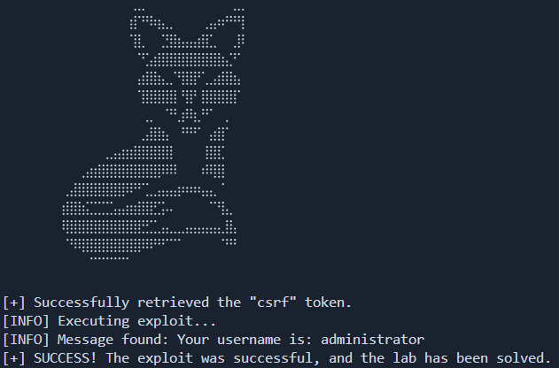

# Lab: SQL Injection vulnerability allowing login bypass

_Leer en Español: [Readme_es.md](./Readme_es.md)_

[__Link to the lab__](https://portswigger.net/web-security/sql-injection/lab-retrieve-hidden-data)

>[!NOTE]
>__Lab Analysis:__ If you want to understand the vulnerability in depth, you will find a detailed technical explanation (no spoilers) regarding the attack logic and database behavior right below the usage section.
>ump directly [there](#methodology--ethics)


# 🛠️ Automation Script

This directory contains an exploit developed in Python designed to automate the detection and exploitation of the vulnerability in this lab.

### __Usage__

>Create a Python virtual environment (Recommended)
```
python -m venv venv
```

>Activate the virtual environment
>- Linux
>```bash
>source venv/bin/activate
>```
>- Windows
>```
>venv\Scripts\activate --> Símbolo del sistema (CMD)
>venv\Scripts\activate.ps1 --> PowerShell
>```

>Install dependencies
```python
pip install -r requirements.txt
```

>Run the script
```python
python exploit.py -h --> Show help menu

python exploit.py -t [URL]
```



## Methodology & Ethics

>[!IMPORTANT]
>__Learning Notice:__ The following section details the vulnerability's mechanics using a pedagogical approach without spoilers. I encourage you to attempt the lab on your own before consulting this analysis. True mastery comes from persistent problem-solving.

---

## Lab Objective

The challenge consists of identifying and exploiting a SQL Injection (SQLi) vulnerability in the login form of a web application. The goal is to perform an `Authentication Bypass` to access the `administrator` account. Unlike data extraction attacks, here we manipulate the query's Boolean logic to nullify password verification, allowing unauthorized access by manipulating the username field.

For this lab, we will explain two methods of exploitation.

### Technical Analysis of the Vulnerability (`' OR 1=1 --`) [exploit_boolean](exploit_boolean.py)

The application performs a SQL query to the database using direct user input. In a legitimate scenario, the database executes:
```SQL
SELECT * FROM users WHERE username = 'pepe' AND password = 'pepe'
```

__The attack Vector: Manipulating Boolean Logic__
Since there is no proper input sanitization in the `username` and `password` fields, we can inject logical operators to alter the query flow.

__Payload used: `' OR 1=1--'`__
By integrating this payload, the resulting query on the server becomes:
```SQL
SELECT * FROM products WHERE username = 'administrator' AND password = '' OR 1=1 --'
```

__Exploit Breakdown:__
- `' OR 1=1`: Introduces a tautological condition (always true). In Boolean logic, `FALSE OR TRUE` always results in TRUE.

- `--` : SQL comment operator (specifically for databases like PostgreSQL or MySQL). This nullifies the rest of the original statement, preventing the final quote (`'`) from causing a syntax error.

__Visualizing the Database Impact__
Consider the following extract from the users table:

| id | username | password |
| :--- | :--- | :--- |
| 1 | administrator | jue8389us"*%8%$^dfy34W |
| 2 | carlos | uiwe^&6f% |
| 3 | wiener | peter |

__Injection Result:__
The database engine evaluates the condition for every row. Since we have requested the user `administrator` with password `''` __OR__ `1=1`, and `1=1` is a constant truth, the database interprets:
_"Return everything for an `administrator` user whose password is `''` or where `1=1` is true."_

### Technical analysis of the vulnerability (`--`)[exploit_commenting](./exploit_commenting.py)

Typically, web applications store user passwords in databases not as plain text, but as __`hashes`__. In a legitimate scenario, the database executes:
```SQL
SELECT * FROM users WHERE username = 'administrator' AND password = hash('pepe')
```

If the web application is "well" configured, when the user enters the payload, the following query would be performed:
```SQL
SELECT * FROM users WHERE username = 'administrator' AND password = hash('' OR 1=1 --')
```

This would generate an error. Depending on how the backend handles errors, this might help verify a SQLi vulnerability, but it cannot be exploited this way.

A more effective way to perform the same attack is by injecting `'--` into the `username` field. The query becomes:
```SQL
SELECT * FROM users WHERE username = 'administrator'--' AND password = hash('pepe')
```

Thus, everything after the `username` verification is commented out, and the database interprets: _"Return everything for the user `administrator`."_ If that user exists, we are allowed to log in as them.

## Protocol Analysis: HTTP POST Method

The vulnerability manifests through the HTTP POST method. This means that the input field values do not travel in the URL (unlike the HTTP GET method), but travel inside the body of the HTTP request.

## 🐍 Python Automation (The Exploit [`exploit_boolean.py`](./exploit_boolean.py))

While manual exploitation is straightforward, automation allows for the development of Pentesting scripting skills and HTTP state management.

__Script Execution Logic:__
1. __Persistence Management__: The script initializes a session object to maintain cookie persistence. This is essential to ensure the server-generated CSRF token is correctly linked to our session during the attack.

2. __Dynamic CSRF Token Extraction__: An initial `GET` request is made to the login page. Using `BeautifulSoup`, the script locates and extracts the anti-CSRF token hidden in the form (`<input name="csrf">`). Without this token, the server would reject any authentication attempt.

3. __SQL Comment Injection Attack__: A `POST` request is sent, injecting the payload `administrator'--` directly into the `username` parameter. This technique uses `--` characters to comment out the rest of the SQL query on the server, effectively removing the password check (`AND password = ...`) and forcing a login as the first user matching the provided name.

4. __Identity Validation and Success__: After the injection, the script parses the DOM of the response page. It looks for the container with the ID `account-content` and extracts the text from the first paragraph. The exploitation is confirmed as successful only if the retrieved message explicitly contains the string `administrator`, verifying that the authentication bypass worked.

## 🐍 Python Automation (The Exploit [`exploit_commenting.py`](./exploit_commenting.py))

__Script Execution Logic:__

1. __Persistence Management__: Same as above, ensuring session consistency.

2. __Dynamic CSRF Token Extraction__: The script retrieves the required anti-CSRF token before attempting the login.

3. __SQL Injection via POST__: A `POST` request is sent to the `/login` endpoint. The request body includes the captured CSRF token and the Tautology Injection payload (`' OR 1=1 --`) in the password field, forcing the database engine to validate the session for the administrator user as true.

4. __Identity Validation and Success__: The script verifies the successful login by checking the `account-content` section for the `administrator` string.

## Mitigation: Preventing Authentication Injection

The definitive solution to prevent this type of bypass is the use of __Prepared Statements (Parameterized Queries)__. By parameterizing the query, the database engine will never interpret characters like `'` or `--` as code; instead, they are treated strictly as part of the username or password string.
```python
# Example of secure backend logic
cursor.execute("SELECT * FROM users WHERE username = %s AND password = %s", (user_input, password_input))
```