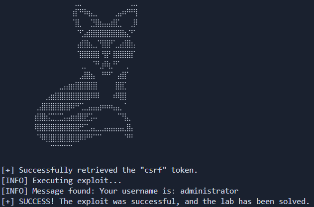

# Lab: Vulnerabilidad "Inyección SQL" que permite bypasear la funcion de login

_Read this in English: [Readme.md](./Readme.md)_

[__Enlace al laboratorio__](https://portswigger.net/web-security/sql-injection/lab-login-bypass)

> [!NOTE]
> **Análisis del Laboratorio:** Si buscas comprender la vulnerabilidad a fondo, justo debajo de la sección de uso encontrarás una **explicación técnica detallada (sin spoilers)** sobre el funcionamiento del ataque y la lógica de la base de datos.
>Ir directamente [allí](#metodología-y-ética)

# Script de Automatización

Este directorio contiene un exploit desarrollado en Python diseñado para automatizar la detección y explotación de la vulnerabilidad de este laboratorio.

### __Uso__

>Crear entonro virtual con Python (Recomendado)
```
python -m venv venv
```

>Activar el entorno virtual
>- Linux
>```bash
>source venv/bin/activate
>```
>- Windows
>```
>venv\Scripts\activate --> Símbolo del sistema (CMD)
>venv\Scripts\activate.ps1 --> PowerShell
>```


>Instalar dependencias
```
pip install -r requirements.txt
```

>Ejecutar el script
```python
python exploit.py -h --> Muestra la ayuda

python exploit -t [URL]
```



---

## Metodología y Ética

>[!important]
>__Aviso de Aprendizaje:__ A continuación se detalla el funcionamiento de la vulnerabilidad bajo un enfoque pedagógico libre de spoilers. Te animo a enfrentarte al laboratorio por tus propios medios antes de consultar este análisis. La verdadera maestría nace de la resolución persistente de problemas.

---

## Objetivo del Laboratorio

El reto consiste en identificar y explotar una vulnerabilidad de Inyección SQL (SQLi) en el formulario de inicio de sesión de una aplicación web. El objetivo es realizar un `Authentication Bypass` (evasión de autenticación) para acceder a la cuenta del usuario `administrator`. A diferencia de los ataques de extracción de datos, aquí manipulamos la lógica booleana de la consulta para anular la verificación de la contraseña, permitiendo el acceso no autorizado mediante la manipulación del campo de nombre de usuario.

Para este laboratorio vamos a explicar dos formas de explotación.

### Análisis Técnico de la Vulnerabilidad (`' OR 1=1 --`) [exploit_boolean](./exploit_boolean.py)

La aplicación realiza una consulta SQL a la base de datos usando directamente la entrada del usuario. En un escenario legítimo, la base de datos ejecuta:
```SQL
SELECT * FROM users WHERE username = 'pepe' AND password = 'pepe'
```

__El vector de ataque: Manipulación de la lógica Booleana__
Al no existir una sanitización adecuada en los campos `username` y `password`, podemos inyectar operadores lógicos para alterar el flujo de la consulta.

__Payload utilizado: `' OR 1=1 --`__
Al integrar este payload, la consulta resultante en el servidor es:
```SQL
SELECT * FROM products WHERE username = 'administrator' AND password = '' OR 1=1 --'
```
__Desglose del exploit:__
- `' OR 1=1`: Introducimos una condición tautológica (siempre verdadera). En lógica Booleana, `FALSE OR CIERTO` resulta siempre en `CIERTO`.
- `--`: Operador de comentario en SQL (específicamente para bases de datos como PostgreSQL o MySQL). Esto anula el resto de la sentencia original, impidiendo que la última comilla (`'`) cree un error de sintaxis.

__Visualización del Impacto en la Base de Datos__
Consideremos el siguiente extracto de la tabla `users`:

| id | username | password |
| :--- | :--- | :--- |
| 1 | administrator | jue8389us"*%8%$^dfy34W |
| 2 | carlos | uiwe^&6f% |
| 3 | wiener | peter |

__Resultado de la inyección__
El motor de base de datos evalúa la condición para cada fila. Dado que hemos solicitado el usuario `administrator` con la contraseña `''` __O__ `1=1`. Como `1=1` es una constante verdadera la base de datos interpreta:
_"Devuelve todo sobre un usuario `administrator` cuya contraseña sea `''` o que `1=1`."_

### Análisis Técnico de la Vulnerabilidad (`--`) [exploit_commenting](exploit_commenting.py)

Normalmente, las aplicaciones web almacenan las contraseñas de los usuarios en las bases de datos no como texto plano sino como __`hashes`__. En un escenario legítimo, la base de datos ejecuta:
```SQL
SELECT * FROM users WHERE username = 'administrator' AND password = hash('pepe')
```

Si la aplicación web se encuentra "bien" configurada, cuando el usuario introduzca el _payload_ se realizaría la siguiente consulta a la base de datos:
```SQL
SELECT * FROM users WHERE username = 'administrator' AND password = hash('' OR 1=1 --')
```

Esto generaría un error que, dependiendo de como se gestionen los errores en el _backend_ nos podrá servir para verificar que realmente existe una vulnerabilidad SQLi aunque no podremos explotarla de esta manera.

Una forma más eficaz de realizar el mismo ataque es inyectando `'--` en el campo `username`. De esta forma, la consulta sería:
```SQL
SELECT * FROM users WHERE username = 'administrator'--' AND password = hash('pepe')
```
Así, todo lo que esté detrás de la verificación del `username` queda comentado y la base de datos interpreta: _"Devuelve todo sobre el usuario `administrator`."_ Si dicho usuario realmente existe en la base de datos, se nos permitirá loguearnos como tal.

## Análisis del protocolo: HTTP POST Method

La vulnerabilidad se manifiesta a través del método HTTP POST. Esto significa que los valores de los campos introducidos no viajan en la URL (como si pasa con el _método HTTP GET_), sino que viaja dentro de la solicitud HTTP (_HTTP Request_).

## 🐍 Automatización con Python (The Exploit [`exploit_boolean.py`](./exploit_boolean.py))

Aunque la explotación manual es sencilla, la automatización permite desarrollar habilidades en Scripting para Pentesting y manejo de estados HTTP.

__Lógica de Ejecución del Script:__
1. __Gestión de persistencia:__ El script inicializa un objeto de sesión para mantener la persistencia de las cookies. Esto es fundamental para asegurar que el token CSRF generado por el servidor esté vinculado correctamente a nuestra sesión durante el ataque.
2. __Extracción dinámica de token CSRF:__ Se realiza una petición inicial `GET` a la página de inicio de sesión. Utilizando `BeautifulSoup`, el script localiza y extrae el valor del token anti-CSRF oculto en el formulario (`<input name="csrf">`). Sin este token, el servidor rechazaría cualquier intento de autenticación.
3. __Ataque de SQL Comment Injection:__ Se envía una petición `POST` inyectando el payload `administrator'--` directamente en el parámetro `username`. Esta técnica utiliza los caracteres `--` para comentar el resto de la consulta SQL en el servidor, eliminando eficazmente la verificación de la contraseña (`AND password = ...`) y forzando el inicio de sesión como el primer usuario que coincida con el nombre proporcionado.
4. __Validación de identidad y Éxito:__ Tras la inyección, el script analiza el DOM de la página de respuesta. Busca el contenedor con el ID `account-content` y extrae el texto del primer párrafo. La explotación se confirma como exitosa solo si el mensaje recuperado contiene explícitamente la cadena `administrator`, verificando que el bypass de autenticación ha sido efectivo.

## 🐍 Automatización con Python (The Exploit [`exploit_commenting.py`](./exploit_commenting.py))

__Lógica de Ejecución del Script:__
1. __Gestión de persistencia:__ El script inicializa un objeto de sesión para mantener la persistencia de las cookies. Esto es fundamental para asegurar que el token CSRF generado por el servidor esté vinculado correctamente a nuestra sesión durante el ataque.
2. __Extracción dinámica de token CSRF:__ Se realiza una petición inicial `GET` a la página de inicio de sesión. Utilizando `BeautifulSoup`, el script localiza y extrae el valor del token anti-CSRF oculto en el formulario (`<input name="csrf">`). Sin este token, el servidor rechazaría cualquier intento de autenticación.
3. __Inyección SQL vía POST:__ Se envía una petición `POST` al endpoint `/login`. El cuerpo de la petición incluye el token CSRF capturado y el payload de __Tautology Injection__ (`' OR 1=1 --`) en el campo de la contraseña, forzando al motor de la base de datos a validar la sesión del usuario administrator como verdadera.
4. __Validación de identidad y Éxito:__ Tras la inyección, el script analiza el DOM de la página de respuesta. Busca el contenedor con el ID `account-content` y extrae el texto del primer párrafo. La explotación se confirma como exitosa solo si el mensaje recuperado contiene explícitamente la cadena `administrator`, verificando que el bypass de autenticación ha sido efectivo.

## Mitigación: Prevención de Inyección en Autenticación

La solución definitiva para evitar este tipo de bypass es el uso de __Sentencias Preparadas (Prepared Statements)__. Al parametrizar la consulta, el motor de la base de datos nunca interpretará los caracteres `'` o `--` como código, sino como parte del texto del nombre de usuario.

```python
# Ejemplo de lógica segura en el backend
cursor.execute("SELECT * FROM users WHERE username = %s AND password = %s", (user_input, password_input))
```