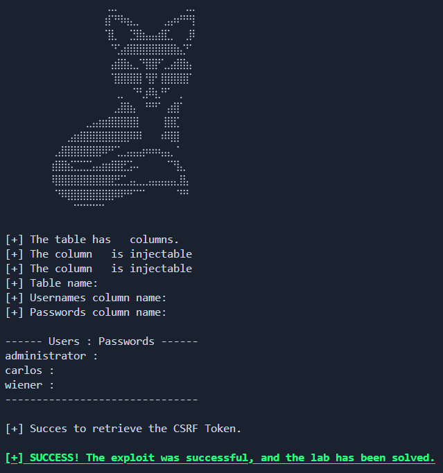

# Lab: SQL Injection vulnerability allowing login bypass

_Leer en Español: [Readme_es.md](./Readme_es.md)_

[__Link to the lab__](https://portswigger.net/web-security/sql-injection/examining-the-database/lab-listing-database-contents-non-oracle)

>[!NOTE]
>__Lab Analysis:__ If you want to understand the vulnerability in depth, you will find a detailed technical explanation (no spoilers) regarding the attack logic and database behavior right below the usage section.
>ump directly [there](#methodology--ethics)


# 🛠️ Automation Script

This directory contains an exploit developed in Python designed to automate the detection and exploitation of the vulnerability in this lab.

### __Usage__

>Create a Python virtual environment (Recommended)
```
python -m venv venv
```

>Activate the virtual environment
>- Linux
>```bash
>source venv/bin/activate
>```
>- Windows
>```
>venv\Scripts\activate --> Símbolo del sistema (CMD)
>venv\Scripts\activate.ps1 --> PowerShell
>```

>Install dependencies
```python
pip install -r requirements.txt
```

>Run the script
```python
python exploit.py -h --> Show help menu

python exploit.py -t [URL]
```



## Methodology & Ethics

>[!IMPORTANT]
>__Learning Notice:__ The following section details the vulnerability's mechanics using a pedagogical approach without spoilers. I encourage you to attempt the lab on your own before consulting this analysis. True mastery comes from persistent problem-solving.

---

## Lab Objective

The goal is to perform a __UNION-based SQL Injection__ attack to exfiltrate credentials from the users table, where names (both table and columns) are dynamically generated and change with each lab instance.

To solve it, the exploit must:

1. __Enumerate__ the number of columns and their data types.

2. __Query the Schema (`information_schema`)__ to discover the randomized names of the users table and its columns.

3. __Extract__ all usernames and passwords.

4. __Automatically authenticate__ as the administrator user while managing CSRF tokens.

---

## Technical analysis of the Vulnerability

The web application is vulnerable to __SQL Injection__ in the category filtering parameter. Since the application displays the query results on the screen, we can use UNION attacks to exfiltrate information directly.

1. __Schema Discovery (Fingerprinting)__
Since the table names are unknown, we query the database's metadata (PostgreSQL/MySQL/Microsoft SQL Server in this case):

- __Table Search:__ To find the table names, we must query the tables table within the information_schema database:
```SQL
UNION SELECT table_name, NULL FROM information_schema.tables
```
We can also use the `WHERE` clause to filter names since the lab changes the target table and column names in each instance, but the name always starts with "_users\_..._".
```SQL
UNION SELECT table_name, NULL FROM information_schema.tables WHERE table_name LIKE 'users_%'
```
The exploit does not use the WHERE clause in this query; instead, it uses regular expressions for the same purpose.

- __Column Search:__ Once we obtain the name of the table containing the users, we query the __information_schema__ again (specifically the __columns__ table) to find the required column names:
```SQL
UNION SELECT table_name, column_name FROM information_schema.columns WHERE table_name = '[table_name]'
```

2. __Credential search:__
Once the required table and column names (e.g., `username_abc123`) are obtained, we construct the final query to display the usernames and their respective passwords on the screen.

If we use the following payload `' UNION SELECT username_u93qu, password_879827jf FROM users_89u902u --` in the category filter, the actual SQL query would look something like this:
```SQL
SELECT name, description FROM products WHERE category = '' UNION SELECT username_u93qu, password_879827jf FROM users_89u902u --'
```
While not mandatory, it is recommended to leave the original category query empty so that only the useful data we are looking for appears on the screen.

---

## 🐍 Python Automation (The Exploit)

This lab is not difficult to perform manually. However, there are several steps required to exploit the vulnerability successfully.

This is where the ability to create custom scripts to automate the entire process truly shines. Manually performing multiple exploits of this type can quickly become a tedious task.

Furthermore, creating your own scripts helps develop skills in Scripting for Pentesting and HTTP state management.

__Script Execution Logic__
The exploit is structured into different functions to ensure reliability:

1. `check_columns`: Uses the incremental ORDER BY technique to determine the width of the original query.

`check_column_data_type`: Verifies which columns accept the String data type by inserting test characters ('a').

__exploit (Multi-stage)__:
- __Phase 1:__ Locates the users table using __Regular Expressions (Regex__) (`^users_.*`). [For more details on the expression, see the Regular Expressions section.](#regular-expressions)

- __Phase 2:__ Identifies the username and password columns using __Regex__ (`^username_.*`, `^password_.*`).

- __Phase 3:__ Extracts the data and stores it in a Python dictionary.

4. `admin_login`: Automates the final login as administrator, completing the attack cycle.

# Mitigation

- __Prepared Statements:__ Using parameters in SQL queries would prevent table metadata from being accessible via injection.

- __Schema Obfuscation:__ Although the script uses Regex to find them, avoiding predictable names in the schema provides an additional layer of "Security through Obscurity" (though it is not a definitive solution).

- __Strict CSRF Tokens:__ Ensure that the CSRF token is tied to the session and has a short lifespan.

# Regular Expressions

In this lab, table and column names are randomized, which prevents the use of static names in the script. To solve this, the exploit uses Python's re module to identify specific patterns within the exfiltrated database schema.

| Patrón | Explicación Técnica | Objetivo en el Lab |
| :---: | :--- | :--- |
| `r"^users_.*` | Searches for any string that starts (`^`) with "_users\__" followed by any character (`.*`). | Identify the dynamically generated users table. |
| `r"^username_.*"` | Locates strings starting with "_username\__". | Identify the column storing usernames. |
| `r"^password_.*"` | Locates strings starting with "_password\__". | Identify the column containing credentials. |


__Why use Regex instead of simple searches?__

- __Flexibility:__ The `re.IGNORECASE` flag makes the script robust against case variations on the server.

- __Precision:__ By using the start anchor `^`, we avoid false positives with other tables that might contain the word "_users_" in the middle of their name.

- __Total Automation:__ It allows the exploit to be __universal__; it will work on any new PortSwigger lab instance without needing to modify the code manually.

- __Efficiency:__ Using Regex with `BeautifulSoup (find(string=...))` is much more efficient than downloading the entire HTML and searching with `if "string" in r.text`, as __Regex__ allows for much stricter structural validation.