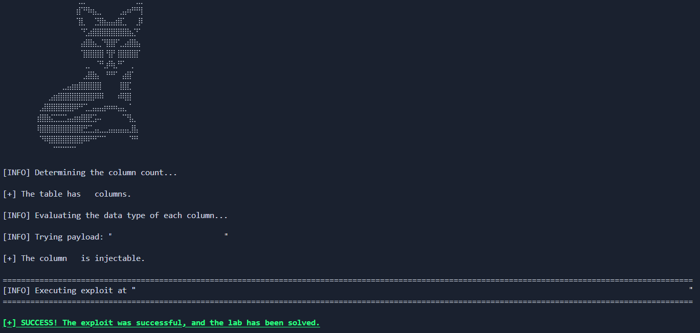

# Lab: SQL Injection vulnerability returning data from MySQL or Microsoft SQL Server databases

_Leer en Español: [Readme_es.md](Readme_es.md)_

[__Link to the Lab__](https://portswigger.net/web-security/sql-injection/examining-the-database/lab-querying-database-version-oracle)

> [!NOTE]
> **Lab Analysis:** If you want to understand the vulnerability in depth, a **detailed technical explanation (no spoilers)** regarding the attack mechanics and database logic is provided right below the usage section.
> Jump directly [there](#methodology--ethics).

## Automation Script

This directory contains an exploit developed in Python designed to automate the detection and exploitation of the vulnerability found in this lab.

### __Usage__

> Create a Python virtual environment (Recommended)
```bash
python -m venv venv
```

>Activate the virtual environment
>- Linux
>```bash
>source venv/bin/activate
>```
>- Windows
>```
>venv\Scripts\activate --> Símbolo del sistema (CMD)
>venv\Scripts\activate.ps1 --> PowerShell
>```

>Install dependencies
```python
pip install -r requirements.txt
```

>Run the script
```python
python exploit.py -h --> Show help menu

python exploit.py -t [URL]
```



---

## Methodology & Ethics

>[!IMPORTANT]
>__Learning Notice:__ The following section details the vulnerability's mechanics using a pedagogical approach without spoilers. I encourage you to attempt the lab on your own before consulting this analysis. True mastery comes from persistent problem-solving.

---

## Lab Objective

The challenge consists of exploiting a __UNION-based SQL Injection vulnerability__ to extract the database software version. Unlike _Oracle_, this environment uses syntax compatible with __MySQL__ and __Microsoft SQL Server__, which requires:

1. Determining the number of columns using `ORDER BY`.

2. Identifying columns that accept `String` data types.

3. Using the global variable `@@version` to retrieve system information.

### Technical Analysis of the vulnerability

The application processes the `category` parameter insecurely, allowing the injection of SQL commands that alter the original result set.

1. __Column Enumeration__
We use `ORDER BY X #` to force a server error when the index exceeds the actual number of columns. The `#` character (URL-encoded as `%23`) is essential in __MySQL__ to comment out the rest of the original query.

2. __Data Type Fingerprinting__
For a `UNION SELECT` to work, the injected columns must match the data types of the original columns. The script systematically tests by inserting `'a'` into each `NULL` position. An `HTTP 200` status code indicates that the column is suitable for displaying text.

3. __System Exfiltration__
Once the injectable column is identified, the server version is requested. In this environment, the `@@version` constant returns specific details about the operating system and the engine version (e.g., Ubuntu/MySQL details).

## Protocol analysis: HTTP GET Method

The vulnerability manifests through the HTTP GET method. Input parameters are transmitted directly in the URL's Query String:

```HTTP
GET /filter?category=Gifts' OR 1=1-- HTTP/1.1
```

This exposure facilitates direct manipulation from the browser's address bar or through scripts, as it does not require sending complex data bodies (unlike POST or JSON).

## 🐍 Python Automation (The Exploit)

While manual exploitation is straightforward, automation helps develop skills in Scripting for Pentesting and HTTP state management.

The script automates the logical "brute-force" process to discover the database structure:

1. __Enumeration Phase (`ORDER BY` Loop):__ The script iterates from 1 to 5 sending requests. Upon detecting an `HTTP 500` status, it calculates that the number of columns is $n-1$.

2. __Data Fingerprinting Phase:__ It creates a list of `NULL` values. It systematically replaces each position with an `'a'` character and checks if the server responds with an `HTTP 200 (OK)`. This confirms that the specific column can display text.

3. __Final Injection and Extraction:__ It constructs the final payload using `UNION SELECT` pointing to `@@version`. Unlike _Oracle_, __MySQL__ and __Microsoft SQL Server__ do not require a `FROM` clause in every `SELECT` statement. Therefore, the final payload will look like:

```HTTP
GET /filter?category=test' UNION SELECT @@version, NULL #
```

4. __Results Validation:__ It uses `BeautifulSoup` to search for the string "`0ubuntu0`" within the page's description table, confirming that the software version has been successfully dumped.

## Remediation

Prevention against UNION attacks follows the same principles as other SQL injections but emphasizes schema control:

- __Parameterized Queries:__ The only definitive defense against SQLi.

- __Input Validation:__ Implement filters that reject special characters such as `'`, `#`, or SQL keywords.

- __WAF (Web Application Firewall):__ Configure rules to detect `UNION` and `ORDER BY` attack patterns.