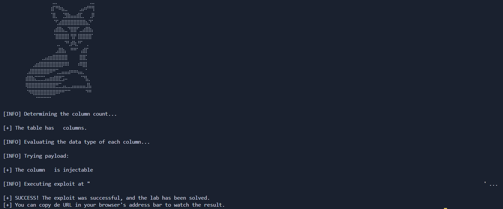

# Lab: SQL Injection vulnerability returning data from an Oracle database

_Leer en Español: [Readme.es.md](Readme.es.md)_

[__Link to the Lab__](https://portswigger.net/web-security/sql-injection/examining-the-database/lab-querying-database-version-oracle)

> [!NOTE]
> **Lab Analysis:** If you want to understand the vulnerability in depth, a **detailed technical explanation (no spoilers)** regarding the attack mechanics and database logic is provided right below the usage section.
> Jump directly [there](#methodology--ethics).

## Automation Script

This directory contains an exploit developed in Python designed to automate the detection and exploitation of the vulnerability found in this lab.

### __Usage__

> Create a Python virtual environment (Recommended)
```bash
python -m venv venv
```

>Activate the virtual environment
>- Linux
>```bash
>source venv/bin/activate
>```
>- Windows
>```
>venv\Scripts\activate --> Símbolo del sistema (CMD)
>venv\Scripts\activate.ps1 --> PowerShell
>```

>Install dependencies
```python
pip install -r requirements.txt
```

>Run the script
```python
python exploit.py -h --> Show help menu

python exploit.py -t [URL]
```



---

## Methodology & Ethics

>[!IMPORTANT]
>__Learning Notice:__ The following section details the vulnerability's mechanics using a pedagogical approach without spoilers. I encourage you to attempt the lab on your own before consulting this analysis. True mastery comes from persistent problem-solving.

---

## Lab Objective

The goal is to exploit a UNION-based SQL Injection vulnerability to retrieve the database version in an Oracle environment. To achieve this, the exploit must:

1. Determine the number of columns returned by the original query.

2. Identify which column is compatible with string data types.

3. Extract version information by querying the v$version system table.

### Technical Analysis of the vulnerability

The application filters products by category. The internal query in Oracle looks similar to this:
```SQL
SELECT name, description FROM products WHERE category = '[user_input]' AND released = 1
```

__1. Determining Column Count (`ORDER BY`)__
To use a `UNION` attack, both queries must return the same number of columns. We use the `ORDER BY X` clause to find the limit where the database throws an error (`HTTP 500`).

- `ORDER BY 1` -- `200 OK`

- `ORDER BY 2` -- `200 OK`

- `ORDER BY 3` -- `500 Internal Server Error` (The table has only two columns)

__2. Data Type Verification__
In __Oracle__, every column in a `UNION` must be compatible with the data type of the corresponding column in the original query. Additionally, __Oracle__ requires a `FROM` clause in every `SELECT` statement, so we use the `DUAL` virtual table.

- __Test Payload:__ `' UNION SELECT 'a', NULL FROM DUAL --`

__3. Version Extraction (Oracle Specific)__
Once the string-compatible column is identified, we query `v$version`, which is a special view in Oracle containing the software banner.

# Protocol analysis: HTTP GET Method
The vulnerability manifests through the HTTP GET method. Input parameters are transmitted directly in the URL's Query String:

```HTTP
GET /filter?category=Gifts' OR 1=1-- HTTP/1.1
```

This exposure facilitates direct manipulation from the browser's address bar or through scripts, as it does not require sending complex data bodies (unlike POST or JSON).

## 🐍 Python Automation (The Exploit)

While manual exploitation is straightforward, automation helps develop skills in Scripting for Pentesting and HTTP state management.

The script automates the logical "brute-force" process to discover the database structure:

1. __Enumeration Phase (`ORDER BY` Loop):__ The script iterates from 1 to 5 sending requests. Upon detecting an `HTTP 500` status, it calculates that the number of columns is $n-1$.

2. __Data Fingerprinting Phase:__ It creates a list of `NULL` values. It systematically replaces each position with an `'a'` character and checks if the server responds with an `HTTP 200 (OK)`. This confirms that the specific column can display text.

3. __Final Injection and Extraction:__ It constructs the final payload using `UNION SELECT` pointing to the `BANNER` column of the `v$version` table.

4. __Results Validation:__ It uses Beaut`i`fulSoup to search for the string _"PL/SQL"_ within the page's description table, confirming that the software version has been successfully dumped.

## Remediation

Prevention against `UNION` attacks follows the same principles as other SQL injections but emphasizes schema control:

- __Prepared Statements:__ These prevent the attacker from closing the quote and initiating a new `UNION` statement.

- __Principle of Least Privilege:__ The database user account used by the web application should not have read permissions on system tables like `v$version` or `v$instance`.

- __Strict Type Validation:__ Ensure that user input only contains expected values (simple alphanumeric) before processing.