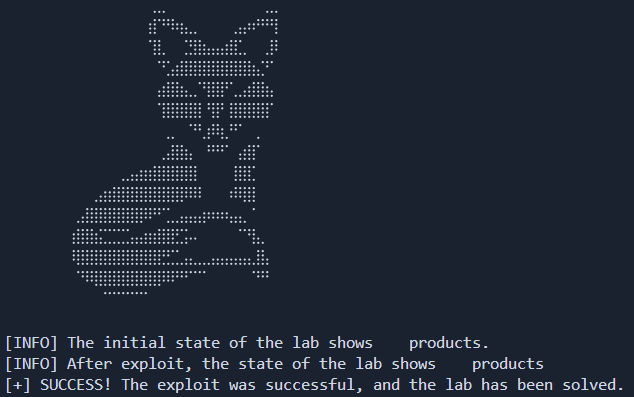

# Lab: "SQL Injection" Vulnerability in the WHERE clause to retrieve hidden data

_Leer en Español: [Readme-es.md](Readme_es.md)_

[__Link to the lab__](https://portswigger.net/web-security/sql-injection/lab-retrieve-hidden-data)

>[!NOTE]
>__Lab Analysis:__ If you want to understand the vulnerability in depth, you will find a detailed technical explanation (no spoilers) regarding the attack logic and database behavior right below the usage section.
>ump directly [there](#methodology--ethics)

## Automatization Script

This directory contains a Python-based exploit designed to automate the detection and exploitation of the vulnerability found in this lab.

### __Usage__

>Create a Python virtual environment (Recommended)
```
python -m venv venv
```

>Activate the virtual environment
>- Linux
>```bash
>source venv/bin/activate
>```
>- Windows
>```
>venv\Scripts\activate --> Símbolo del sistema (CMD)
>venv\Scripts\activate.ps1 --> PowerShell
>```

>Install dependencies
```python
pip install -r rquirements.txt
```

>Run the script
```python
python exploit.py -h --> Show help menu

python exploit.py -t [URL]
```



---

>[!NOTE]
>__Lab Analysis:__ If you want to understand the vulnerability in depth, you will find a detailed technical explanation (no spoilers) regarding the attack logic and database behavior right below the usage section.

---

## Methodology & Ethics

>[!IMPORTANT]
>__Learning Notice:__ The following section details the vulnerability's mechanics using a pedagogical approach without spoilers. I encourage you to attempt the lab on your own before consulting this analysis. True mastery comes from persistent problem-solving.

---

## Lab Objective

The challenge is to identify and exploit a SQL Injection (SQLi) vulnerability within the category filter of a web application. Success is defined by manipulating the query logic to force the display of hidden (unreleased) products, which are otherwise protected by a database restriction.

### Technical Analysis of the vulnerability

The application filters products based on a specific category using a dynamic query. In a legitimate scenario, the database executes:
```SQL
SELECT * FROM products WHERE category = '[Category]' AND released = 1
```

__The attack Vector: Manipulating Boolean Logic__
Due to the lack of proper input sanitization in the category parameter, we can inject logical operators to alter the query's flow.

__Payload Used:__ `' OR 1=1 --`
By integrating this payload, the resulting query on the server becomes:
```SQL
SELECT * FROM products WHERE category = '[Category]' OR 1=1 --' AND released = 1
```

__Exploit Breakdown:__
- `'OR 1=1`: We introduce a tautological condition (always true). In Boolean logic, FALSE OR TRUE always results in TRUE.
- `--`: SQL comment operator (specific to databases like PostgreSQL or MySQL). This nullifies the rest of the original statement, discarding the `AND released = 1` validation.

__Visulaizing the Impact on Data__
Consider the following extract from the `products` table:
id,name,category,stock,released
1,Coffee Maker,Cooking,238,1
2,Gift Card,Gifts,1033,1
3,Lawnmower,Garden,122,0

__Injection Result:__
The database engine evaluates the condition for every row. Since `1=1` is a constant truth and the `released = 1` restriction has been commented out, the database returns all rows in the table, including the product with ID: 3, exposing sensitive/hidden information.


## Protocol analysis: HTTP GET Method
The vulnerability manifests through the HTTP GET method. Input parameters are transmitted directly in the URL's Query String:

```HTTP
GET /filter?category=Gifts' OR 1=1-- HTTP/1.1
```

This exposure facilitates direct manipulation from the browser's address bar or through scripts, as it does not require sending complex data bodies (unlike POST or JSON).

## 🐍 Python Automation (The Exploit)

While manual exploitation is straightforward, automation allows for the development of Pentesting scripting skills and the handling of HTTP states.

__Script Execution Logic:__

1. __Establishing a Baseline:__ The script performs an initial request to count the products visible under normal conditions (where released = 1).

2. __Dynamic Injection:__ A second request is sent with the payload injected into the URL.

3. __Content-Based Verification:__ Using the BeautifulSoup library, the script compares the volume of data received. If the number of elements in the DOM (product div objects) is higher than the baseline, the exploitation is confirmed as successful.

## Remediation: How to fix this vulnerability?

The root cause of this vulnerability is the direct concatenation of user-supplied data into the SQL query. To prevent SQL Injection (SQLi), the following best practices should be implemented:

### 1. Parameterized Queries (Prepared Statements)

This is the most effective defense. By using placeholders, the database engine treats user input strictly as data, never as executable code.

### 2. Use of ORMs

Leverage modern frameworks that handle database interaction securely by default.

### 3. Input Validation (Allow-listing)

Validate that the `category` parameter matches a predefined list of valid categories before executing the query.