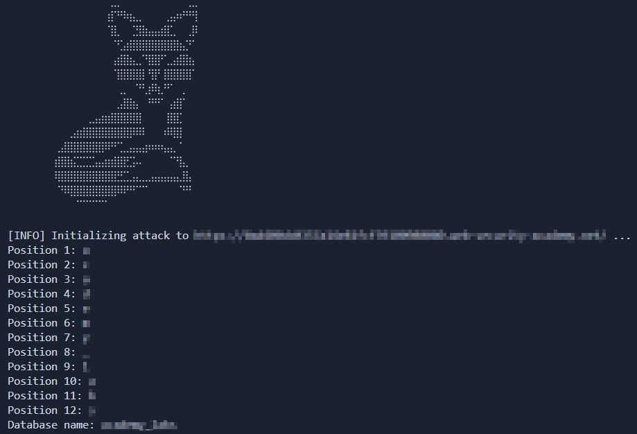
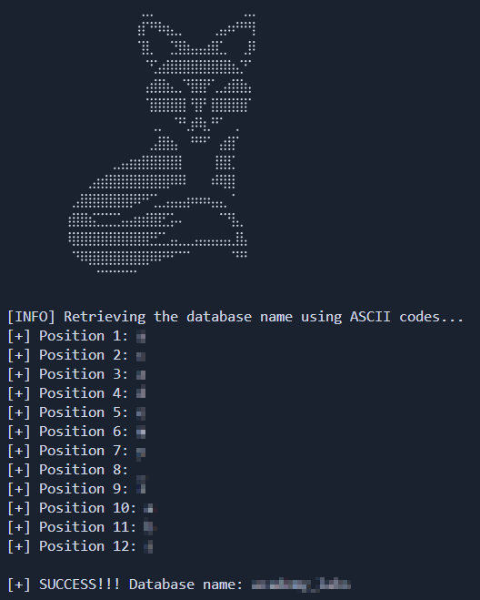
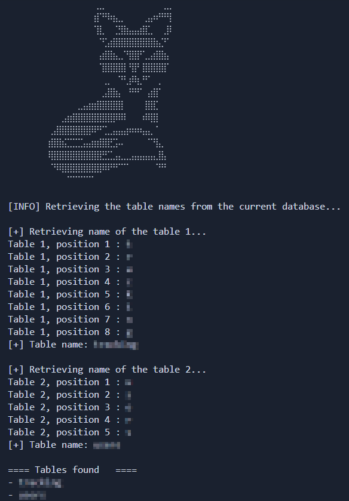

# Lab: SQL Injection vulnerability allowing login bypass

_Leer en Español: [Readme_es.md](./Readme_es.md)_

[__Link to the lab__](https://portswigger.net/web-security/sql-injection/examining-the-database/lab-listing-database-contents-oracle)

>[!NOTE]
>__Lab Analysis:__ If you want to understand the vulnerability in depth, you will find a detailed technical explanation (no spoilers) regarding the attack logic and database behavior right below the usage section.
>ump directly [there](#methodology--ethics)


# 🛠️ Automation Script

This directory contains an exploit developed in Python designed to automate the detection and exploitation of the vulnerability in this lab.

### __Usage__

>Create a Python virtual environment (Recommended)
```
python -m venv venv
```

>Activate the virtual environment
>- Linux
>```bash
>source venv/bin/activate
>```
>- Windows
>```
>venv\Scripts\activate --> Símbolo del sistema (CMD)
>venv\Scripts\activate.ps1 --> PowerShell
>```

>Install dependencies
```python
pip install -r requirements.txt
```

>Run the script
```python
python exploit.py -h --> Show help menu

python exploit.py -t [URL] [-D] [--tables] [--sleep X]
```

```bash
# Avanzed example: Using 3 seconds delay
python exploit_ascii.py -t [URL] -D --tables --sleep 3
```

---

## Methodology & Ethics

>[!IMPORTANT]
>__Learning Notice:__ The following section details the vulnerability's mechanics using a pedagogical approach without spoilers. I encourage you to attempt the lab on your own before consulting this analysis. True mastery comes from persistent problem-solving.

---

## Lab Objective
>[!note]
>This exercise is not part of the standard PortSwigger lab suite. However, we leverage the Lab: Blind SQL injection with time delay to perform an attack that demonstrates how server latency can be converted into a binary oracle capable of revealing the internal structure of a database, character by character, even under 'total darkness' conditions.

The fundamental purpose of this project is to demonstrate the feasibility of sensitive data exfiltration in environments where the server does not return detailed errors or data directly in the response ("blind" environments).

The exploit focuses on exploiting a __Time-Based Blind SQLi__ vulnerability. In the absence of visual output, the technical goal is to turn the server into a binary oracle that "responds" through latency.

- __Side-Channel Data Inference:__ Implement a "question-response" logic based on time, where a response delay (`pg_sleep`) confirms the truth of a logical premise regarding the stored data.

- __Character-by-Character Exfiltration:__ Reconstruct structured information (database and table names) by individually extracting characters converted to ASCII codes.

- __Algorithmic Optimization:__ Replace conventional linear search with a binary search algorithm, minimizing the number of requests required and reducing the noise generated in the server logs.

---

## Technical analysis of the Vulnerability

The web application is vulnerable to __SQL Injection__ within the `TrackingId` cookie parameter. In this instance, no data is returned on the screen (__Blind SQLi__).

Unlike a _classical SQL injection_, here we work in "__total darkness__". Success depends on the millisecond precision of response time measurement. The script must distinguish between a delay induced by the payload and natural network latency, ensuring that every recovered character is 100% accurate before moving to the next position.



### How does it work?

The application uses a special cookie called `TrackingId` to track user behavior.

Under normal circumstances, the application would perform a SQL query similar to this:
```SQL
SELECT * FROM users WHERE trackingId = '[TrackingId]'
```

This query can be vulnerable if not properly defended, even if the end-user cannot easily modify this parameter.

Using tools like _Burp Suite_, we can modify the value of this cookie. This allows us to perform something like this:
```http
GET /filter?category=test HTTP/1.1
Host: vulnerable-website.com
Cookie: session=Hjh757UG64gd75; TrackingId=x' || pg_sleep(10) --
...
```

In the query above, we use the __PostgreSQL__ concatenation operator to join the real `TrackingId` value with the `pg_sleep(10)` payload.
```SQL
SELECT * FROM users WHERE trackingId = 'x' || pg_sleep(10) --'
```

The database engine interprets: "_I must join the value of the `trackingId` column with the result of the `pg_sleep` function (which will be `void`)._"

By using this query, we force the database to perform a time delay that confirms the existence of the __Blind SQL Injection vulnerability__, although we cannot exfiltrate information directly yet as nothing is displayed.

But, what if there were a way to exfiltrate information by leveraging these time delays? This is known as __Time-Based Inference SQL Injection attacks__.

If we manipulate the __TrackingId__ cookie again and add the following:
```http
GET /filter?category=test HTTP/1.1
Host: vulnerable-website.com
Cookie: session=Hjh757UG64gd75; TrackingId=x' || (SELECT CASE WHEN(SUBSTRING(current_database(),1,1) = 'a') THEN pg_sleep(5) ELSE pg_sleep(0) END) --
...
```

__Payload Breakdown:__
1. `SELECT CASE WHEN () THEN ... ELSE ... END`: This is the primary logical structure. It works like an if/else in traditional programming.

- __Condition:__ Is the character value at position $1$ equal to 'a'?
- __True Action:__ If true, execute `pg_sleep(5)`, generating a detectable delay.
- __False Action:__ If false, execute `pg_sleep(0)`, returning the response immediately.

2. __SUBSTRING(string, start, length)__: This function allows us to isolate a single character from a string (such as the database name).

- __Example:__ `SUBSTRING('admin',1,1)` returns _'a'_.

3. `pg_sleep(seconds)`: This function pauses the database engine process. It is our __side-channel communication__. We don't need to see the data on the screen; the time the server takes to respond gives us the "__Yes__" or "__No__" answer.

---

## Python Automation (The Exploits)

Predictably, performing a medium or large-scale attack by manually modifying the character position in the HTTP request is unsustainable.

This is where the ability to create custom scripts for advanced attacks shines. Using Python, we can create a script that performs HTTP requests, iterating through each character until the real value (database name, table names, or credentials) is found.

### Simple version ([exploit.py](./exploit.py))

_This script performs exactly what has been explained so far._

It sends HTTP requests to the web server, modifying the `TrackingId` __Cookie__ by adding the payload responsible for the SQL queries. It probes the same character position until the comparison condition is successful (takes between 5 and 6 seconds to receive the response), then moves to the next position.

#### The Linear Search Problem

The previous version faces an issue. Imagine we are exfiltrating the database name (e.g., `zyx_vault`).

Until now, we have used a __linear search__. We ask character by character in ascending order: "Is it _'a'_?, Is it _'b'_?, Is it _'c'_? ..."

For the first letter (_'z'_), the process would be:

1. __Iteration 1:__ Is it _'a'_? --> Fast response (0s).

2. __Iteration 2:__ Is it _'b'_? --> Fast response (0s).

3. ...

4. __Iteration 26:__ Is it _'z'_? --> __Correct!__ (Server takes 5s).

#### What is the real problem?

Although the first 25 responses are "_fast_", they are not instantaneous. Every request has a network cost (latency, DNS resolution, TLS handshake). If each request takes _100ms_, we've already lost __2.5 seconds__ just on "failed questions" before reaching 'z'. Multiplied by a long name, the time increases exponentially.

---

## Binary Search Method

To understand why binary search is so powerful in this context, we must look at the data representation layer.

>The server does not understand the concept of a "letter" like we do; it understands numerical values.

### ASCII Standard

Every printable character in a PostgreSQL database is represented by a number according to the __ASCII (American Standard Code for Information Interchange)__ standard.

- The range we care about is __32 (space)__ to __126 (~)__.

- This range includes all letters (A-Z, a-z), numbers (0-9), and special symbols.

By using the `ASCII(SUBSTRING(...))` function, the script converts the letter we want to exfiltrate into an __integer__. This allows us to stop using equality comparisons (`=`) and start using mathematical magnitude comparisons (`>` or `<`).

#### Mathematical Efficiency: _O(n)_ vs _O(log n)_

The payload we use utilizes the "greater than" (`>`) comparison to interrogate the search engine:
```SQL
... CASE WHEN (ASCII(SUBSTRING(...,1)) > 95) THEN pg_sleep(5) ...
```

If the ASCII value is greater than 95, the server "sleeps." If it is less than or equal, it responds immediately.

In a _time-based attack_, every "failed" question has a cost. If we search for a character in the printable ASCII set (__95 characters__):

- __Linear Search ($O(n)$):__ In the worst case, the script performs 95 requests. For a 10-character database name, we might need _950 requests_.

- __Binary Search ($O(\log n)$):__ By halving the search range at each step, the maximum number of requests to find any character is __7__. For that same 10-character name, we would only perform _70 requests_.

### Binary Version ([exploit_ascii.py](./exploit_ascii.py))

This exploit leverages mathematical efficiency to perform the attack as cleanly as possible.

Imagine the character in the database is __'M'__ (__ASCII value 77__). This is how the script infers the result at a low level:

1. __Initial State:__ Range [32, 126]. Midpoint (mid): 79.

2. __Question 1:__ Is the ASCII value $> 79$?
- __Response:__ NO (Server responds in 0s).
- __Action:__ New range is [32, 79].

3. __Question 2:__ New midpoint: 55. Is the value $> 55$?
- __Response:__ YES (Server takes 5s).
- __Action:__ New range is [56, 79].

4. __Question 3:__ New midpoint: 67. Is the value $> 67$?
- __Response:__ YES (5s). New range [68, 79].

5. __Question 4:__ New midpoint: 73. Is the value $> 73$?
- __Response:__ YES (5s). New range [74, 79].

6. __Question 5:__ New midpoint: 76. Is the value $> 76$?
- __Response:__ YES (5s). New range [77, 79].

7. __Question 6:__ New midpoint: 78. Is the value $> 78$?
- __Response:__ NO (0s). Range closes to [77, 78].

8. __Final:__ The algorithm determines the value is 77.
- __Result:__ `chr(77)` in Python returns __'M'__.




### Advantages

- __Footprint Reduction:__ In ethical hacking, less is more. Performing 7 requests instead of 90 drastically reduces the chances of being detected by a __WAF (Web Application Firewall)__ or an __IDS__ looking for repetitive scanning patterns.

- __Dictionary Independence:__ By working on the ASCII numerical range rather than a manual list of letters, the script automatically exfiltrates numbers, hyphens, dots, and special characters without code modification.

- __Determinism:__ Execution time is predictable. We don't depend on "getting lucky" with the database starting with the letter __'A'__.